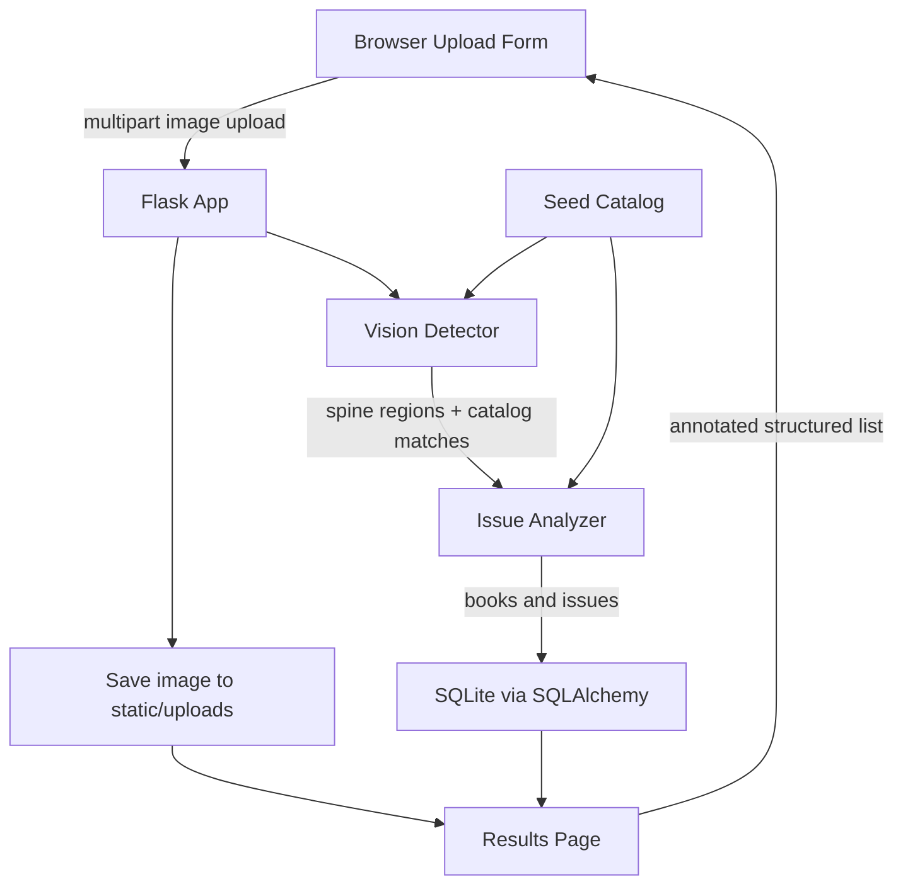

# Shelf Scout

Shelf Scout is a Flask MVP that lets you upload a bookshelf photo and returns a structured results page with detected book titles, duplicate flags, and missing-series gap flags.

This MVP uses a local, deterministic computer-vision pipeline optimized for the included demo shelf image: it detects vertical book-spine-like color regions, maps spine colors to a small seed catalog, persists scans to SQLite, and analyzes duplicates/missing volumes. It requires no external APIs.

## Architecture



## Core feature

1. Upload a bookshelf photo.
2. The app detects colored vertical book spines and maps them to likely titles/authors from the local seed catalog.
3. It stores a `Scan`, `DetectedBook` rows, and `Issue` rows.
4. It returns a single results page showing:
   - uploaded photo
   - detected books with confidence, position, and shelf row
   - duplicate-title flags
   - missing-volume gap flags for known series

## Quick start

```bash
cd brain-shelf-scout
python -m venv .venv
source .venv/bin/activate  # Windows: .venv\Scripts\activate
pip install -r requirements.txt
python app.py
```

Open <http://127.0.0.1:5000>.

For the most reliable demo, click **Generate demo shelf image**, download/save the generated image if desired, then upload it on the home page. The generated shelf intentionally contains:

- a duplicate title: `The Lunar Gate Vol. 1`
- a missing series volume: `The Lunar Gate Vol. 2`

## Smoke test

After installing dependencies, run:

```bash
python smoke_test.py
```

The script initializes the app database, generates a demo image, runs detection, and verifies that books and issues are produced.

## Environment variables

Copy `.env.example` to `.env` if you want to customize settings.

| Variable | Default | Description |
| --- | --- | --- |
| `FLASK_ENV` | `development` | Flask environment label. |
| `SECRET_KEY` | `dev-secret-change-me` | Flask session secret. Change for real deployments. |
| `DATABASE_URL` | `sqlite:///shelf_scout.db` | SQLAlchemy database URL. |
| `UPLOAD_FOLDER` | `static/uploads` | Relative/absolute folder for uploaded images. |
| `MAX_CONTENT_LENGTH_MB` | `8` | Maximum uploaded image size in megabytes. |

## Notes and limitations

- This MVP avoids paid/external OCR services. It uses color/spine segmentation and a local catalog rather than full text OCR.
- Real-world bookshelf OCR would require integrating a vision/OCR model, but the database, upload flow, issue analysis, and results UX are already in place.
